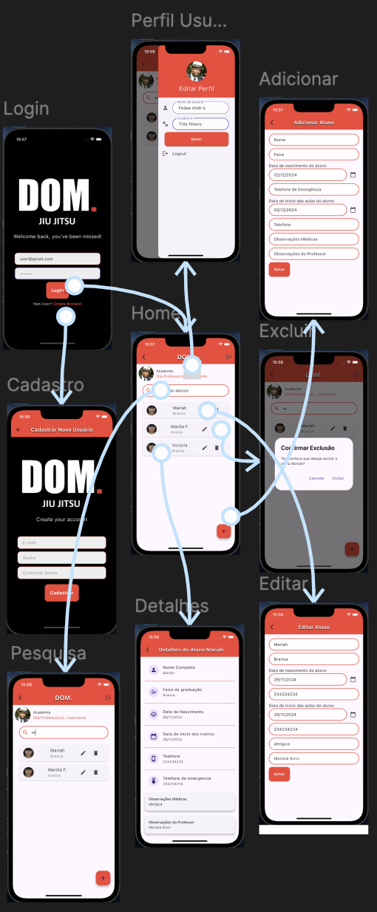

# Dom_control

**Projeto de gerenciamento de alunos para professores, simples construído com Flutter e Firebase.**

Este projeto visa criar um aplicativo para auxiliar na organização e gestão de alunos da equipe de DOM.Jiu-Jitsu.

**Funcionalidades:**

* **Cadastro de usuários:** Criação de contas de usuários com autenticação segura.
* **Criação e edição de Alunos:** Adicionar, editar e excluir alunos.
* **Busca de alunos:** Busca por nome de alunos para facilitar a gestão.
  

**Funcionalidades Futuras e Melhorias:**

* **Controle de frequência:**
  * Registrar a presença dos alunos em cada aula.
  * Gerar relatórios de frequência.
* **Gestão de planos e pagamentos:**
  * Cadastrar diferentes planos e preços. 
  * Gerar boletos e notificações de vencimento. 
  * Registrar os pagamentos realizados.
* **Comunicação:**
  * Enviar mensagens em massa para os alunos. 
  * Criar grupos de comunicação por faixa ou turma.
* **Relatórios:**
  * Gerar diversos tipos de relatórios, como relatório de alunos por faixa, relatório financeiro, etc.
* **Integrações:**
  * Integrar com outros sistemas, como sistemas de pagamento ou plataformas de e-mail marketing.

**Tecnologias:**

* **Flutter**
* **Firebase**

**Observation:**
Este projeto foi originalmente pensado para atender a proposta do Projeto Integrador 
do curso de Análise e Desenvolvimento de Sistemas da PUC-GO.

# Instruções de Instalação e Execução do Projeto Dom-Control

## Pré-requisitos
Antes de começar, certifique-se de ter as seguintes ferramentas instaladas em sua máquina:

* Flutter;
* Dart;
* Firebase CLI;
* Git,

**Passos para Instalação**

1. Clone o Repositório 
   * Abra o terminal e clone o repositório do GitHub:

>git clone https://github.com/seu-usuario/dom-control.git
cd dom-control

2. Instale as Dependências
* No diretório do projeto, execute o comando abaixo para instalar as dependências:

>flutter pub get

3. Configuração do Firebase

* Crie um projeto no Firebase aqui.
* Adicione um aplicativo Android e/ou iOS ao seu projeto Firebase.
* Baixe o arquivo google-services.json (para Android) e/ou GoogleService-Info.plist (para iOS) e coloque-os nos diretórios apropriados:
- - android/app para google-services.json
- - ios/Runner para GoogleService-Info.plist

* Configure o Firebase Authentication e Firestore conforme necessário.
* Execute o Aplicativo

* Conecte um dispositivo ou inicie um emulador e execute o comando abaixo para iniciar o aplicativo:

>flutter run

## Configuração Adicional
* Ambiente de Desenvolvimento: Recomenda-se o uso do Visual Studio Code, Android Studio ou o que eu utilizei o IntelliJ para um melhor ambiente de desenvolvimento.
* Variáveis de Ambiente: Certifique-se de configurar quaisquer variáveis de ambiente necessárias, como chaves de API do Firebase.

## Contribuição
Se você deseja contribuir com o projeto, siga os passos abaixo:

1. Fork o Repositório

2. Crie uma Branch para sua Feature

>git checkout -b minha-feature
Commit suas Mudanças

>git commit -m 'Adiciona minha feature'

3. Envie para o Repositório Remoto

>git push origin minha-feature

4. Abra um Pull Request
